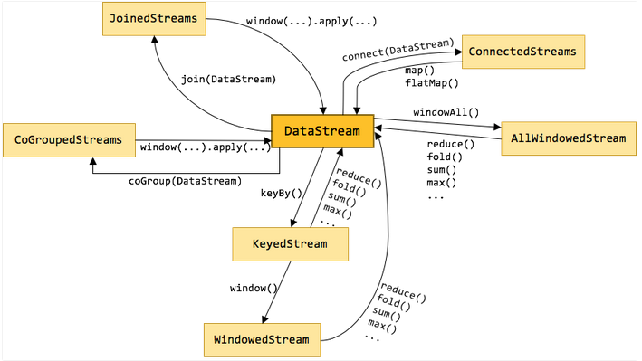
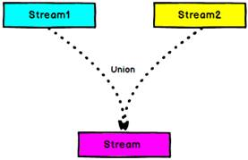
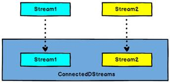

## 数据流转换

### 概述

官方文档 [Apache Flink 1.12 Documentation: 算子](https://ci.apache.org/projects/flink/flink-docs-release-1.12/zh/dev/stream/operators/)

[Java代码](../java/src/main/java/com/ngt/transformation/)
[Scala代码](../scala/src/main/scala/com/ngt/transformation/)

|    Transformation    |                           类型转换                           |                             描述                             |
| :------------------: | :----------------------------------------------------------: | :----------------------------------------------------------: |
|       **map**        |                   DataStream → DataStream                    |                  获取一个元素并生成一个元素                  |
|     **FlatMap**      |                   DataStream → DataStream                    |               获取一个元素并产生0、1或多个元素               |
|      **Filter**      |                   DataStream → DataStream                    |           对每个元素求值，并保留函数返回true的元素           |
|      **KeyBy**       |                   DataStream → KeyedStream                   |                 将流划分为逻辑上不相连的分区                 |
|      **Reduce**      |                   KeyedStream → DataStream                   |              将聚合值和当前值聚合生成新的聚合值              |
|   **Aggregations**   |                   KeyedStream → DataStream                   |        在KeyedStream上滚动聚合，注意min和minBy的区别         |
|      **Window**      |                 KeyedStream → WindowedStream                 |       根据某些特征(5S)将每个keyed streams中的数据分组        |
|    **WindowAll**     |                DataStream → AllWindowedStream                |               根据某些特性(5S)将所有流事件分组               |
|   **Window Apply**   | WindowedStream → DataStream<br/>AllWindowedStream → DataStream |                   将一般函数应用于整个窗口                   |
|      **Union**       |                   DataStream* → DataStream                   |                对**相同类型的几个流**进行合并                |
|   **Window Join**    |              DataStream,DataStream → DataStream              |          通过连接条件将**不同类型的两个流**进行连接          |
|  **Interval Join**   |             KeyedStream,KeyedStream → DataStream             | 连接两个 keyed streams，e1.timestamp + lowerBound <= e2.timestamp <= e1.timestamp + upperBound |
|  **Window CoGroup**  |              DataStream,DataStream → DataStream              |                                                              |
|     **Connect**      |           DataStream,DataStream → ConnectedStreams           |   “连接”两个数据流，保留它们的类型。允许两个流之间共享状态   |
| **CoMap, CoFlatMap** |                ConnectedStreams → DataStream                 |            类似于ConnectedStreams上的map和flatMap            |
|     **Iterate**      |          DataStream → IterativeStream → DataStream           |        通过迭代条件和迭代操作对DataStream进行迭代操作        |
|     **Project**      |                   DataStream → DataStream                    |     从元组类型的数据流中抽取元组中部分元素，Scala中没有      |





### map

作用：获取一个元素并生成一个元素，比如将一个 word 生成一个 (word,1) 元组

示例：flink  → (flink, 1)

手动调用 transform 实现 map 操作，

```java
/*
Params:
	operatorName – name of the operator, for logging purposes
	outTypeInfo – the output type of the operator
	operator – the object containing the transformation logic
*/
SingleOutputStreamOperator<String> myMap = lines.transform("MyMap",
                TypeInformation.of(String.class), new StreamMap<>(String::toUpperCase));
```

继承  AbstractStreamOperator< > 实现 OneInputStreamOperator< > ，如果不继承 AbstractStreamOperator 就需要实现超过 10 个方法，有两种数据输出方式：

- 创建一个 StreamRecord 的数据用于输出
- 使用 replace 方法，将要输出的数据替换原来的数据

注意数据必须使用 output.collect() 手动输出

```java
public static class MyStreamMap extends AbstractStreamOperator<String> implements OneInputStreamOperator<String, String> {
    @Override
    public void processElement(StreamRecord<String> element) throws Exception {
        String value = element.getValue();
        String upperCase = value.toUpperCase();

        // 1. 创建一个 StreamRecord 的数据用于输出
        //StreamRecord<String> stringStreamRecord = new StreamRecord<>(upperCase);
        //output.collect(stringStreamRecord);

        // 2. 推荐使用replace方法，将要输出的数据替换原来的
        element.replace(upperCase);

        // 必须手动输出数据
        output.collect(element);
    }
}
```


### flatmap

作用：扁平化映射，获取一个元素并产生0、1或多个元素，

示例：flink, spark, hadoop → (flink, 1)  (spark, 1)  (hadoop, 1)，将一行数据拆分成多个元组

```java
// Map 对于每个输入都必须有输出
new MapFunction<String, String>() {
    @Override
    public String map(String value) throws Exception {
        return null;
    }
}

// FlatMapFunction 可以通过 out.collect() 对于1个输入实现0个、1个或多个输出
new FlatMapFunction<String, String>() {
    @Override
    public void flatMap(String value, Collector<String> out) throws Exception {
    }
}
```

输出流中除 "error" 之外的字符串

```java
SingleOutputStreamOperator<String> mapOut = lines.flatMap(new FlatMapFunction<String, String>() {
    @Override
    public void flatMap(String value, Collector<String> out) throws Exception {
        String[] words = value.split(" ");
        for (String word : words) {
            if (!"error".equals(word)) {
                out.collect(word);
            }
        }
    }
});
```

继承  AbstractStreamOperator< > 实现 OneInputStreamOperator< >

```java
SingleOutputStreamOperator<String> myFlatMap = lines.transform("MyFlatMap",
                TypeInformation.of(String.class), new MyFlatMap());

public static class MyFlatMap extends AbstractStreamOperator<String> implements OneInputStreamOperator<String, String> {
    @Override
    public void processElement(StreamRecord<String> element) throws Exception {
        String line = element.getValue();
        String[] words = line.split(" ");
        for (String word : words) {
            if (!"error".equals(word)) {
                // 注意此处要使用 replace 方法替换
                output.collect(element.replace(word));
            }
        }
    }
}
```


### filter

作用：对流进行过滤，保留符合条件的元素

示例： 1, 2, 3, 4, 5, 6  ===\>  filter(i -> (i & 1) == 0)  \=\==>  2,4,6

```java
SingleOutputStreamOperator<Integer> filter = nums.filter(new FilterFunction<Integer>() {
    @Override
    public boolean filter(Integer value) throws Exception {
        return (value & 1) == 0;
    }
});

SingleOutputStreamOperator<Integer> filter1 = nums.filter(i -> (i & 1) == 0);

SingleOutputStreamOperator<Integer> myFilter = nums.transform("MyFilter", TypeInformation.of(Integer.class), new MyStreamFilter());

public static class MyStreamFilter extends AbstractStreamOperator<Integer> implements OneInputStreamOperator<Integer, Integer> {
    @Override
    public void processElement(StreamRecord<Integer> element) throws Exception {
        Integer value = element.getValue();
        if ((value & 1) == 0) {
            output.collect(element.replace(value));
        }
    }
}
```


### keyby

作用：将流划分为逻辑上不相连的分区，输入类型必须是元组，Java lambda表达式还需要使用returns 指定类型

```java
// 1. 使用下标，只适用于元组，新版中已过时
map.keyBy(0).sum(1).print();

// 2. 使用 KeySelector
map.keyBy(new KeySelector<Tuple2<String, Integer>, String>() {
    @Override
    public String getKey(Tuple2<String, Integer> value) throws Exception {
        return value.f0;
    }
}).sum(1).print();

// 3. 使用 lambda 表达式，此时类型可以省略
map.keyBy(d -> d.f0).sum(1).print();
```

同时使用多个字段作为分组的依据，有两种方式：

- 将多个字段直接进行相加，实现简答，但是不便于后续的操作
- 将多个字段组合成元组，实现稍微复杂，但是后续操作方便

```java
// 1. 同时使用多个字段作为分组的依据
provinceCityAndMoney.keyBy(0, 1).sum(2).print();

// 2. 使用 KeySelector, 将两个字段相加
provinceCityAndMoney.keyBy(new KeySelector<Tuple3<String, String, Double>, String>() {
    @Override
    public String getKey(Tuple3<String, String, Double> value) throws Exception {
        return value.f0 + value.f1;
    }
}).sum(2).print();

// 3. 使用 KeySelector, 将两个字段构成一个元组
provinceCityAndMoney.keyBy(new KeySelector<Tuple3<String, String, Double>, Tuple2<String, String>>() {
    @Override
    public Tuple2<String, String> getKey(Tuple3<String, String, Double> value) throws Exception {
        return Tuple2.of(value.f0, value.f1);
    }
}).sum(2).print();

// 4. 使用 lambda 表达式，将两个字段相加
provinceCityAndMoney.keyBy(value -> value.f0 + value.f1).sum(2).print();

// 5. 使用 lambda 表达式，将两个字段构成一个元组
provinceCityAndMoney.keyBy(value -> Tuple2.of(value.f0, value.f1)).sum(2).
    returns(Types.TUPLE(Types.STRING, Types.STRING, Types.DOUBLE)).print();
```


### reduce

作用：将聚合值和当前值聚合生成新的聚合值

示例：可以使用reduce 实现 wordcount

```java
SingleOutputStreamOperator<Tuple2<String, Integer>> reduced = keyed.reduce(new ReduceFunction<Tuple2<String, Integer>>() {
    @Override
    public Tuple2<String, Integer> reduce(Tuple2<String, Integer> value1, Tuple2<String, Integer> value2) throws Exception {
        value1.f1 = value1.f1 + value2.f1;
        return value1;
    }
});
```


### Aggregations

min和minBy的区别：

- min返回的是参与分组的字段和要比较字段的最小值，如果数据中还有其他字段，其他字段的值是总是第一次输入的数据的值。
- minBy返回的是要比较的最小值对应的全部数据。

```java
KeyedStream<Tuple2<String, Integer>, String> keyed = wordAndNum.keyBy(data -> data.f0);

SingleOutputStreamOperator<Tuple2<String, Integer>> resMin = keyed.min(1);
resMin.print();

SingleOutputStreamOperator<Tuple2<String, Integer>> resMax = keyed.max(1);
resMax.print();

// min 不会更新非分区字段
provinceCityAndMoney.keyBy(t -> t.f0).min(2).print();

// minBy 会更新非分区字段，会返回第一个具有最小值的元素
provinceCityAndMoney.keyBy(t -> t.f0).minBy(2).print();

// minBy 会更新非分区字段，当第二次参数为 false 的时候，会返回最后个具有最小值的元素
provinceCityAndMoney.keyBy(t -> t.f0).minBy(2, false).print();
```


### Union



作用：合并 2 个或多个相同类型的流

示例：

注意 Union 要求相互连接的流类型必须一样

```java
DataStreamSource<String> lines1 = env.socketTextStream("192.168.31.8", 8888);
DataStreamSource<String> lines2 = env.socketTextStream("192.168.31.8", 9999);

// 两个 source 分支
lines1.union(lines2).print();

// 只有一个source分支，重复发送两次
lines1.union(lines1).print();

DataStreamSource<Integer> elements = env.fromElements(1, 2, 3, 4, 5, 6, 7, 8, 9, 0);

// Union 要求流的数据类型必须相同
// lines1.union(elements)
```


### Window Join

官方文档 [Apache Flink 1.12 Documentation: Joining](https://ci.apache.org/projects/flink/flink-docs-release-1.12/zh/dev/stream/operators/joining.html)

作用：通过连接条件将两个流连接到一起，最终形成一个新的流

示例：将两个 wordcount 流，Join 成一个新的 wordcount  流

```java
DataStream<Tuple2<String, Integer>> apply = keyBy1.join(keyBy2)
    .where(data -> data.f0)
    .equalTo(data -> data.f0)
    .window(TumblingProcessingTimeWindows.of(Time.seconds(10)))
    .apply(new JoinFunction<Tuple2<String, Integer>, Tuple2<String, Integer>, Tuple2<String, Integer>>() {
        @Override
        public Tuple2<String, Integer> join(Tuple2<String, Integer> first, Tuple2<String, Integer> second) throws Exception {
            return Tuple2.of(first.f0, first.f1 + second.f1);
        }
    });
```


### Interval Join

作用：连接两个 keyed streams，e1.timestamp + lowerBound <= e2.timestamp <= e1.timestamp + upperBound

注意：时间必须是  EventTime 

```java
wordAndOne1.keyBy(data -> data.f0)
    .intervalJoin(wordAndOne2.keyBy(data -> data.f0))
    //                .inEventTime()
    .between(Time.seconds(-2), Time.seconds(2))
    .process(new ProcessJoinFunction<Tuple2<String, Integer>, Tuple2<String, Integer>, Tuple2<String, Integer>>() {
        @Override
        public void processElement(Tuple2<String, Integer> left, Tuple2<String, Integer> right,
                                   Context ctx, Collector<Tuple2<String, Integer>> out) throws Exception {
            out.collect(Tuple2.of(left.f0, left.f1 + right.f1));
        }
    }).print();
```


### Connect

作用：两个数据流被 Connect 之后，只是被放在了一个同一个流中，内部依然**保持各自的数据和形式不发生任何变化**，两个流相互独立，可以共享状态



```java
// 允许两个流之间共享状态
ConnectedStreams<String, Double> connect = lines1.connect(map);

// 流1的类型，流2的类型，生成新流的类型
SingleOutputStreamOperator<String> result = connect.map(new CoMapFunction<String, Double, String>() {
    @Override
    public String map1(String value) throws Exception {
        return value.toUpperCase();
    }

    @Override
    public String map2(Double value) throws Exception {
        return value * 10 + "";
    }
    // 两个流的map方法执行完的返回值会放入到新的流中
});
```


### Iterate

作用：通过迭代条件和迭代操作对DataStream进行迭代操作

```java
// 调用 iterate 方法 DataStrea -> IterativeStream
IterativeStream<Long> iteration = numbers.iterate();

// 迭代操作
SingleOutputStreamOperator<Long> iterationBody = iteration.map(new MapFunction<Long, Long>() {
    @Override
    public Long map(Long value) throws Exception {
        System.out.println("iterate input =>" + value);
        return (value -= 2);
    }
});

// 继续迭代的条件
SingleOutputStreamOperator<Long> feedback = iterationBody.filter(new FilterFunction<Long>() {
    @Override
    public boolean filter(Long value) throws Exception {
        return value > 0;
    }
});

// 传入迭代的条件
iteration.closeWith(feedback);

// 退出迭代的条件
SingleOutputStreamOperator<Long> output = iterationBody.filter(new FilterFunction<Long>() {
    @Override
    public boolean filter(Long value) throws Exception {
        return value <= 0;
    }
});

output.print("output value");
```


## 物理分区

官方文档： [Apache Flink 1.12 Documentation: 算子](https://ci.apache.org/projects/flink/flink-docs-release-1.12/zh/dev/stream/operators/#物理分区)

物理分区方法可以根据需要在数据转换完成后对数据分区进行更细粒度的配置

### Custom partitioning

```java
// 自定义数据的分区，spark 1，flink 2，hadoop 3，其他数据发送到分区0
SingleOutputStreamOperator<Tuple2<String, Integer>> mapDataStream = words.map(new RichMapFunction<String, Tuple2<String, Integer>>() {
    @Override
    public Tuple2<String, Integer> map(String value) throws Exception {
        return Tuple2.of(value, getRuntimeContext().getIndexOfThisSubtask());
    }
}).setParallelism(4);

// 使用自定义的方式将数据发送到下游
DataStream<Tuple2<String, Integer>> partitionCustom = mapDataStream.partitionCustom(new Partitioner<String>() {
    @Override
    public int partition(String key, int numPartitions) {
        int res = 0;
        if ("spark".equals(key)) {
            res = 1;
        } else if ("flink".equals(key)) {
            res = 2;
        } else if ("hadoop".equals(key)) {
            res = 3;
        }
        return res;
    }
}, tp -> tp.f0);
```

```
spark : 3 -> 1
spark : 0 -> 1
flink : 1 -> 2
hadoop : 2 -> 3
flink : 3 -> 2
java : 0 -> 0
scala : 1 -> 0
hadoop : 2 -> 3
```

### Random partitioning

随机，随机发送到下游任意一个Task

```java
SingleOutputStreamOperator<String> mapDataStream = words.map(new RichMapFunction<String, String>() {
    @Override
    public String map(String value) throws Exception {
        return value + " ：" + getRuntimeContext().getIndexOfThisSubtask();
    }
}).setParallelism(1);

// 使用随机的方式将数据发送到下游
DataStream<String> random = mapDataStream.shuffle();

random.addSink(new RichSinkFunction<String>() {
    @Override
    public void invoke(String value, SinkFunction.Context context) throws Exception {
        System.out.println(value + " -> " + getRuntimeContext().getIndexOfThisSubtask());
    }
});
```

```
aaaa ：0 -> 2
aaaa ：0 -> 3
bbbb ：0 -> 3
dddd ：0 -> 2
eeee ：0 -> 2
aaaa ：0 -> 0
cccc ：0 -> 1
oooo ：0 -> 1
```

### Rebalancing partitioning

轮询，第一个随机发送到下游任意一个Task，随后以此开始轮询

```java
SingleOutputStreamOperator<String> mapDataStream = words.map(new RichMapFunction<String, String>() {
    @Override
    public String map(String value) throws Exception {
        return value + " ： " + getRuntimeContext().getIndexOfThisSubtask();
    }
}).setParallelism(2);

// 使用轮询的方式将数据发送到下游
DataStream<String> rebalance = mapDataStream.rebalance();

rebalance.addSink(new RichSinkFunction<String>() {
    @Override
    public void invoke(String value, Context context) throws Exception {
        System.out.println(value + " -> " + getRuntimeContext().getIndexOfThisSubtask());
    }
});
```

```
使用轮询的方式发送到下游，注意是上游的节点分别轮询
aaaa ： 0 -> 1
aaaa ： 1 -> 0
gggg ： 0 -> 2
cccc ： 1 -> 1
bbbb ： 0 -> 3
hhhh ： 1 -> 2
wwww ： 0 -> 0
nnnn ： 1 -> 3
```

> 注意，上游的Task 分别轮询，相互之间没有关联

### Rescaling partitioning

将元素循环分区到下游操作的子集


```java
SingleOutputStreamOperator<String> mapDataStream = words.map(new RichMapFunction<String, String>() {
    @Override
    public String map(String value) throws Exception {
        return value + " ： " + getRuntimeContext().getIndexOfThisSubtask();
    }
}).setParallelism(2);

// 使用轮询的方式将数据发送到下游
DataStream<String> rescale = mapDataStream.rescale();

rescale.addSink(new RichSinkFunction<String>() {
    @Override
    public void invoke(String value, SinkFunction.Context context) throws Exception {
        System.out.println(value + " -> " + getRuntimeContext().getIndexOfThisSubtask());
    }
});
```

```
0 -> 0,1  1 -> 2,3
aaaa ： 1 -> 2
aaaa ： 0 -> 0
gggg ： 1 -> 3
cccc ： 0 -> 1
bbbb ： 1 -> 2
hhhh ： 0 -> 0
wwww ： 1 -> 3
nnnn ： 0 -> 1
```

### Broadcasting partitioning

将上游的每个数据发送到下游的所有 Task

```java
env.setParallelism(4);

SingleOutputStreamOperator<String> mapDataStream = words.map(new RichMapFunction<String, String>() {
    @Override
    public String map(String value) throws Exception {
        return value + " ： " + getRuntimeContext().getIndexOfThisSubtask();
    }
}).setParallelism(1);

// 将上游的每个数据发送到下游的所有 Task
DataStream<String> broadcast = mapDataStream.broadcast();

broadcast.addSink(new RichSinkFunction<String>() {
    @Override
    public void invoke(String value, SinkFunction.Context context) throws Exception {
        System.out.println(value + " -> " + getRuntimeContext().getIndexOfThisSubtask());
    }
});
```

上游的并行度为1，下游的并行度为4，将上游的数据发送到下游的每一个Task中

```
aaaa ： 0 -> 3
aaaa ： 0 -> 2
aaaa ： 0 -> 0
aaaa ： 0 -> 1
bbbb ： 0 -> 3
bbbb ： 0 -> 2
bbbb ： 0 -> 0
bbbb ： 0 -> 1
```


## 算子链和资源组

将两个算子链接在一起能使得它们在同一个线程中执行，从而提升性能，因为线程的切换需要耗费更多的资源

### Start new chain

从Map开启一个新的算子链，可以将计算密集的任务单独放置于一个资源槽中

```java
// 从Map开启一个新的算子链，可以将计算密集的任务单独放置于一个资源槽中
SingleOutputStreamOperator<Tuple2<String, Integer>> wordAndOne = filterd.map(new MapFunction<String, Tuple2<String, Integer>>() {
    @Override
    public Tuple2<String, Integer> map(String value) throws Exception {
        return Tuple2.of(value, 1);
    }
}).startNewChain();
```

```
Source: Socket Stream  (Parallelism：1)  --rebalance-->
Flat Map -> Filter     (Parallelism：8)  --forward-->
Map                    (Parallelism：8)  --hash-->
Keyed Aggregation -> Sink: Print to Std. Out(Parallelism：8)
```

### Disable chaining	

```java
SingleOutputStreamOperator<String> filterd = words.filter(new FilterFunction<String>() {
    @Override
    public boolean filter(String value) throws Exception {
        return value.startsWith("error");
    }
}).disableChaining();
```

```
Source: Socket Stream (Parallelism：1)  --rebalance-->
Flat Map              (Parallelism：8)  --forward-->
Filter                (Parallelism：8)  --forward-->
Map                   (Parallelism：8)  --hash-->
Keyed Aggregation -> Sink: Print to Std. Out(Parallelism：8)
```

### Set slot sharing group

```java
SingleOutputStreamOperator<String> filterd = words.filter(new FilterFunction<String>() {
    @Override
    public boolean filter(String value) throws Exception {
        return value.startsWith("error");
    }
}).setParallelism(4)
    .disableChaining()
    .slotSharingGroup("doit");// 后面共享资源槽的名字都是 doit

SingleOutputStreamOperator<Tuple2<String, Integer>> wordAndOne = filterd.map(new MapFunction<String, Tuple2<String, Integer>>() {
    @Override
    public Tuple2<String, Integer> map(String value) throws Exception {
        return Tuple2.of(value, 1);
    }
}).slotSharingGroup("default");// 切换到默认的资源槽
```


